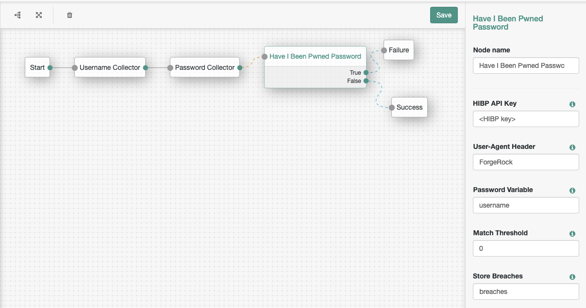

<!--
 * The contents of this file are subject to the terms of the Common Development and
 * Distribution License (the License). You may not use this file except in compliance with the
 * License.
 *
 * You can obtain a copy of the License at legal/CDDLv1.0.txt. See the License for the
 * specific language governing permission and limitations under the License.
 *
 * When distributing Covered Software, include this CDDL Header Notice in each file and include
 * the License file at legal/CDDLv1.0.txt. If applicable, add the following below the CDDL
 * Header, with the fields enclosed by brackets [] replaced by your own identifying
 * information: "Portions copyright [year] [name of copyright owner]".
 *
 * Copyright 2017 ForgeRock AS.
-->

## Have I Been Pwned Password Authentication Node

An authentication decision node which checks the supplied password against the Have I Been Pwned database of passwords previously exposed in data breaches (https://haveibeenpwned.com/Passwords).

The Pwned Passwords service was created in August 2017 after NIST released guidance specifically recommending that user-provided passwords be checked against existing data breaches. In February 2018, version 2 of the service was released with more than half a billion passwords, each now also with a count of how many times they'd been seen exposed. A version 3 release in July 2018 contributed a further 15.6M passwords to bring the total to 517M.

See also: https://www.troyhunt.com/ive-just-launched-pwned-passwords-version-2/ and NIST guidelines: https://pages.nist.gov/800-63-3/sp800-63b.html

### Installation

Copy the .jar file from the ../target directory into the ../web-container/webapps/openam/WEB-INF/lib directory where AM is deployed. Restart the web container to pick up the new node. The node will then appear in the authentication trees components palette.

### Usage

The node configuration requires the name of the shared state variable (or transient shared state) containing the password to validate, and a threshold indicating the maximum number of recorded breaches the password is associated with before it is rejected. A value of 0 will reject any password which has been recorded in any breach. Optionally the number of recorded breaches can be returned and stored in shared state.

This node provides 2 outcomes: true, indicating that the password is associated with a known breach, or false, indicating that no known breaches.

### Disclaimer

The sample code described herein is provided on an "as is" basis, without warranty of any kind, to the fullest extent permitted by law. ForgeRock does not warrant or guarantee the individual success developers may have in implementing the sample code on their development platforms or in production configurations.

ForgeRock does not warrant, guarantee or make any representations regarding the use, results of use, accuracy, timeliness or completeness of any data or information relating to the sample code. ForgeRock disclaims all warranties, expressed or implied, and in particular, disclaims all warranties of merchantability, and warranties related to the code, or any service or software related thereto.

ForgeRock shall not be liable for any direct, indirect or consequential damages or costs of any type arising out of any action taken by you or others related to the sample code.

### Release notes

2.2.0
* Remove the authentication fields since they are not needed according to the API documentation: https://haveibeenpwned.com/API/v2#SearchingPwnedPasswordsByRange